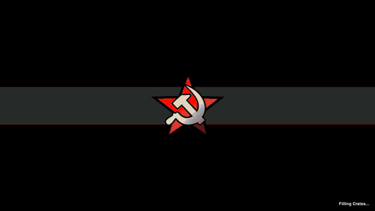

# WarGames

WarGames turns OpenRA Red Alert into a computer-use environment for agentic AI.
An agent receives pixels and a small CUA tool set, then sends mouse/keyboard/wait
actions back to the simulator.

The runtime never calls an LLM and never trains a model. It does three things:
capture frames, apply tool calls, and compute rewards from private simulator
state. Your agent or external harness owns model calls. Prime/prime-rl owns
gradient updates.

## Example Output

This is a short Kimi K2.5 smoke run. The agent receives screenshots, chooses
CUA actions, and WarGames applies them to the live OpenRA window.



## Install

```bash
python -m venv venv
source venv/bin/activate
pip install -r requirements.txt
```

Red Alert needs a working OpenRA checkout:

```bash
export LAYERBRAIN_WARGAMES_REDALERT_OPENRA_ROOT=/path/to/openra-source
export LAYERBRAIN_WARGAMES_REDALERT_OPENRA_BINARY=/path/to/openra-source/launch-game.sh
```

## Local Secrets

Create `local.env` from the template. `local.env` is gitignored.

```bash
cp local.env.example local.env
```

Use provider-standard names for model keys:

```bash
OPENAI_API_KEY=
OPENAI_BASE_URL=
OPENAI_MODEL=
ANTHROPIC_API_KEY=
ANTHROPIC_MODEL=
GOOGLE_API_KEY=
GOOGLE_MODEL=
```

`LAYERBRAIN_PRIME` and `LAYERBRAIN_OPENREWARD` are publish/admin keys only.
WarGames does not use them for model inference.

## Tasks

Tasks are mission + seed + split + reward profile.

```bash
wargames tasks --game redalert --split debug
```

Splits:

- `debug`: tiny smoke tasks
- `train`: tasks agents may learn from
- `validation`: tune prompts/profile weights/max steps
- `test`: held-out reported benchmark tasks
- `curriculum`: ordered train tasks

The catalog rejects the same `(mission_id, seed)` appearing in multiple splits.
It also rejects `train_only` reward profiles on `test`.

## Agents

Agents are named YAML configs under `agents/` or your own `--agent-dir`.

```bash
wargames agents list
wargames agents validate agents/scripted-wait.yaml
```

Example:

```yaml
id: my-agent
driver: python
factory: my_project.agent:create_agent
provider: openai
model: ${OPENAI_MODEL}
api_key_env: OPENAI_API_KEY
base_url: ${OPENAI_BASE_URL}
config:
  temperature: 0.2
  top_p: 0.9
  max_tokens: 256
  timeout_seconds: 20
  disable_reasoning: false
  reject_reasoning_models: false
  reasoning_effort: medium
  extra_body:
    enable_thinking: true
    chat_template_kwargs:
      enable_thinking: true
```

The Python factory receives the `AgentSpec` and returns an object implementing:

```python
async def start(task): ...
async def decide(obs): ...
async def close(): ...
```

For OpenAI-compatible providers, `config` is passed through to the local
agent wrapper. Use it to choose model behavior per run. For fast non-thinking
smoke runs, set `disable_reasoning: true` and keep `max_tokens` small. For
models that need internal thinking, set `disable_reasoning: false` and pass the
provider-specific `extra_body` they require. WarGames does not own those keys or
settings; the agent config does.

## Run Locally

```bash
wargames run \
  --task redalert.debug.smoke.seed-000000 \
  --agent scripted-wait \
  --watch none \
  --record summary_only
```

For demo/debug runs, record frames and export video later:

```bash
wargames run \
  --task redalert.debug.smoke.seed-000000 \
  --agent scripted-wait \
  --watch window \
  --record full \
  --video frames

wargames export <run_id> --out exports --video mp4
```

MP4 is export-only. Runs write frames; export turns frames into a shareable
video.

## Reward Profiles

List profiles:

```bash
wargames profile list --game redalert
```

Built-ins:

- `terminal`: win/loss only
- `standard`: terminal + mild dense shaping
- `dense`: training-only dense profile
- `protective`: defense-aligned profile that rewards friendly-force preservation
- `aggressive_stress_test`: training-only contrast profile, blocked from test

Validate a profile YAML:

```bash
wargames profile validate scenarios/redalert/profiles/protective.yaml
```

Profiles are the behavior dial. The same model can be evaluated under different
profiles to measure whether reward design changes behavior.

The full profile schema, every Red Alert reward field, built-in primitives, and
Prime RL/OpenReward examples are documented in
[`docs/reward_profiles.md`](docs/reward_profiles.md).

## Watching

Local:

```bash
wargames run --task ... --agent ... --watch window
```

Replay public events from disk:

```bash
wargames watch <run_id>
```

Public event files never include hidden state. Private traces are only written
when explicitly requested.

## OpenReward

The OpenReward implementation lives in `wargames.environments.openreward`.
The public OpenReward environment is `layerbrain/wargames`.
`environments/wargames-openreward` is only the thin publish wrapper.

```bash
uv pip install -e ./environments/wargames-openreward
uvicorn wargames_openreward.app:app --port 8001
```

Smoke the OpenReward protocol locally:

```bash
curl http://127.0.0.1:8001/list_environments
curl http://127.0.0.1:8001/wargames/tools
curl http://127.0.0.1:8001/standard/splits
curl -X POST http://127.0.0.1:8001/standard/tasks \
  -H 'content-type: application/json' \
  -d '{"split":"debug"}'
```

Firehorse can run Codex/Claude/Gemini against the environment. WarGames exposes
only CUA tools. CUA-only is enforced by the environment and conformance tests.

## Prime Intellect

The Prime implementation lives in `wargames.environments.prime`.
The public Prime environment is `layerbrain/wargames`.
`environments/prime` is only the thin publish wrapper.

```bash
uv pip install -e ./environments/prime
prime eval run wargames --config environments/prime/configs/eval-debug.toml -n 1 -r 1
```

Prime RL uses the shipped TOML configs. WarGames supplies the environment and
reward signal; Prime/prime-rl owns rollouts, batching, GPUs, and gradient
updates.

RL training changes behavior by changing `reward_profile` in the Prime config:

```toml
split = "train"
reward_profile = "protective"
recorder_mode = "none"
max_steps = 500
rollouts_per_example = 8
```

Use `dense` or `protective` on `train`/`curriculum`, then report against
`terminal` or `standard` on `test`.

## Tests

```bash
source venv/bin/activate
python -m unittest tests.evaluation tests.harness
python -m unittest discover -s environments/wargames-openreward/tests/conformance
python -m unittest discover -s environments/prime/tests/conformance
```
