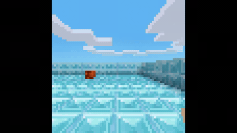

# Craftium

Craftium is the voxel survival and crafting environment in WarGames.

Missions cover navigation, tree chopping, cave traversal, dungeon exploration,
spider combat, open-world survival, and Craftium's `sequence0_25` continual
dungeon tasks through Craftium's Gymnasium interface.



Rewards use Craftium's trusted `info` state: native task reward, player
position and velocity, view angles, voxel observation summaries, and terminal
task outcome.

Craftium is created by Mikel Mas and contributors. WarGames uses the upstream
Python package and credits the [Craftium project](https://github.com/mikelma/craftium),
[Craftium documentation](https://craftium.readthedocs.io/), and the
[Craftium paper](https://arxiv.org/abs/2407.03969). Craftium builds on
[Luanti](https://www.luanti.org/).

## Run It

```bash
wargames install --game craftium
wargames missions --game craftium
wargames run \
  --game craftium \
  --mission craftium.chop-tree.normal \
  --agent scripted-wait \
  --record summary_only
```

The game runs inside the Craftium Docker runtime image. `wargames install`
ensures the pinned Craftium package is available in that runtime and records
the install manifest in the Craftium cache volume.

## Missions

WarGames ships 32 upstream Craftium tasks: seven single-agent Gymnasium
environments and the 25-task `sequence0_25` continual dungeon sequence. Each
task is exposed through three WarGames difficulty variants. The task objective
stays the same, and the step budget gets stricter from easy to normal to hard,
so the catalog has 96 mission entries.

| Catalog slice | Count |
|---|---:|
| Upstream single-agent environments | 7 |
| Upstream `sequence0_25` CRL tasks | 25 |
| Upstream task total | 32 |
| WarGames mission variants | 96 |

```bash
wargames missions --game craftium
```

Mission IDs use the environment slug and difficulty, for example
`craftium.chop-tree.normal`, `craftium.open-world.hard`, and
`craftium.crl.sequence0-25.task-00.normal`.

Difficulty variants keep the same upstream task and tighten the step budget:

| Difficulty | Step budget |
|---|---:|
| Easy | 150% of the upstream task budget |
| Normal | 100% of the upstream task budget |
| Hard | 75% of the upstream task budget |

## Live Control

Craftium uses the same keyboard and mouse action format as the other games:

```bash
printf '%s\n' \
  '[{"name":"key_down","arguments":{"key":"w"}},{"name":"wait","arguments":{"ms":500}},{"name":"key_up","arguments":{"key":"w"}}]' \
  | wargames control \
      --game craftium \
      --mission craftium.chop-tree.normal \
      --actions -
```

Useful controls:

| Action | Control |
|---|---|
| Move | Hold `w`, `a`, `s`, or `d` |
| Look | `move_mouse` left, right, up, or down |
| Jump | Press `Space` |
| Dig/attack | Left mouse button or `Control` |
| Place/use | Right mouse button or `e` |
| Hotbar | Press `1` through `5` |
| Let time pass | Send `wait` |

## Rewards

Rewards are scored from hidden Craftium state after each action.

Useful signals:

| Signal | Why it matters |
|---|---|
| `reward` | Native Craftium task progress. |
| `total_reward` | Accumulated native progress. |
| `player.position` | Movement through the world. |
| `player.velocity` | Movement dynamics. |
| `voxel.nonzero_nodes` | Nearby voxel structure. |
| `mission.finished` / `mission.failed` | Final outcome. |

Reward profiles:

| Reward profile | Use |
|---|---|
| `standard` | Follow native task reward, explore, and finish the scenario |

```bash
wargames reward-profile list --game craftium
```

The Craftium profile files live in `scenarios/craftium/profiles/`. The full
reward profile spec is in [`../reward_profiles.md`](../reward_profiles.md).

## Agent Setup

An agent is just a program that stays running. WarGames writes one observation
JSON line to stdin, waits for one turn JSON line on stdout, applies that turn to
Craftium, and repeats.

```python
import json
import sys

for line in sys.stdin:
    observation = json.loads(line)
    turn = [
        {"name": "key_down", "arguments": {"key": "w"}},
        {"name": "wait", "arguments": {"ms": 500}},
        {"name": "key_up", "arguments": {"key": "w"}},
    ]
    print(json.dumps(turn), flush=True)
```

```yaml
id: my-craftium-agent
kind: subprocess
command: ["python", "my_agent.py"]
```
