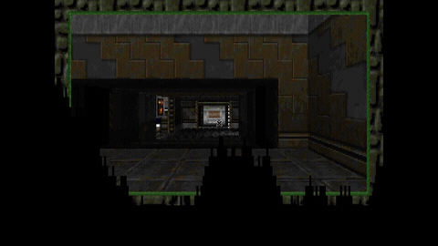

# Doom

Doom is the fast first-person arcade environment in WarGames.

WarGames runs Chocolate Doom with Freedoom IWADs. Missions cover map traversal,
combat, survival, pickups, secrets, and exits.

Rewards use trusted state from a WarGames exporter compiled into Chocolate
Doom: health, armor, ammo, kills, secrets, items, map progress, and exit state.



## Run It

```bash
wargames install --game doom
wargames missions --game doom
wargames run \
  --game doom \
  --mission doom.map.map01.easy \
  --agent doom-controls \
  --record summary_only
```

The game runs inside the Doom Docker runtime image. `wargames install` clones
Chocolate Doom into the Doom Docker cache volume, builds the WarGames state
exporter into the binary, and uses the Freedoom assets supplied by the runtime.

## Missions

WarGames exports Freedoom Phase 1 and Phase 2 maps as missions.

| Difficulty | Missions |
|---|---:|
| Easy | 68 |
| Normal | 68 |
| Hard | 68 |
| Total | 204 |

```bash
wargames missions --game doom
```

Phase 2 maps use IDs like `doom.map.map01.normal`. Phase 1 episode maps use
IDs like `doom.episode.e1m1.normal`.

## Live Control

Send actions as JSON lines:

```bash
printf '%s\n' \
  '[{"name":"key_down","arguments":{"key":"ArrowUp"}},{"name":"wait","arguments":{"ms":1000}},{"name":"key_up","arguments":{"key":"ArrowUp"}}]' \
  | wargames control \
      --game doom \
      --mission doom.map.map01.easy \
      --actions - \
      --watch
```

Useful controls:

| Action | Control |
|---|---|
| Move forward | Hold `ArrowUp` |
| Move backward | Hold `ArrowDown` |
| Turn | Hold `ArrowLeft` or `ArrowRight` |
| Fire | Press or hold `Control` |
| Use door/switch | Press `Space` |
| Run | Hold `Shift` |
| Strafe | Hold `Alt` with `ArrowLeft` or `ArrowRight` |

## Rewards

Rewards are scored from hidden Doom state after each action.

Useful signals:

| Signal | Why it matters |
|---|---|
| `level.kills` | Combat progress. |
| `level.items` | Item pickup progress. |
| `level.secrets` | Exploration progress. |
| `level.elapsed_ticks` | Time pressure. |
| `player.x/y/angle` | Player pose. |
| `player.health` | Survival. |
| `player.armor` | Defensive buffer. |
| `player.ammo` | Available weapon resources. |
| `player.weapons` | Weapon inventory. |
| `player.keys` | Keycard/skull progression. |
| `player.damage_taken` | Damage penalty signal. |
| `mission.finished` / `mission.failed` | Final outcome. |

Reward profiles:

| Reward profile | Use |
|---|---|
| `standard` | Reward kills, items, secrets, health, low damage, and efficient completion |

```bash
wargames reward-profile list --game doom
```

The Doom profile files live in `scenarios/doom/profiles/`. The full profile
spec is in [`../reward_profiles.md`](../reward_profiles.md).

## Agent Setup

`doom-controls` is a small included subprocess agent that demonstrates held
movement, turning, firing, and use-key input:

```bash
wargames run \
  --game doom \
  --mission doom.map.map01.easy \
  --reward-profile standard \
  --agent doom-controls \
  --record full
```

Send Doom controls as primitive events:

```json
{"name":"key_down","arguments":{"key":"ArrowUp"}}
{"name":"key_up","arguments":{"key":"ArrowUp"}}
{"name":"key_down","arguments":{"key":"Control"}}
{"name":"key_up","arguments":{"key":"Control"}}
{"name":"wait","arguments":{"ms":250}}
```
