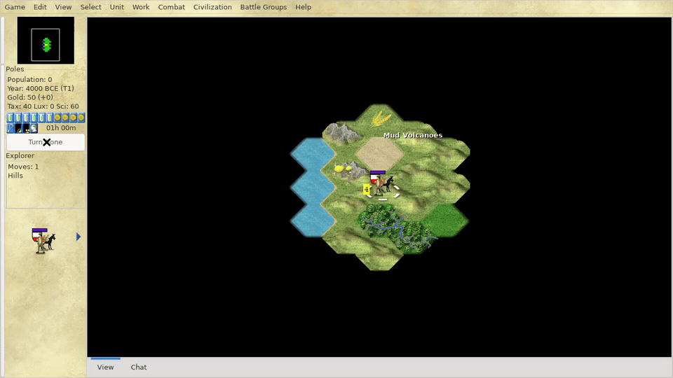

# Freeciv

Freeciv is the low-memory, long-horizon turn-based strategy environment in
WarGames. Missions cover packaged historical and tutorial scenarios with
exploration, settlement, production, diplomacy, and conquest.

Rewards use authoritative Freeciv server save snapshots: turn, year, players,
cities, units, treasury, tax rates, map
knowledge, and victory/defeat state.



## Run It

```bash
wargames install --game freeciv
wargames missions --game freeciv
wargames run \
  --game freeciv \
  --mission freeciv.scenario.earth-small \
  --agent scripted-wait \
  --record summary_only
```

The game runs inside the Freeciv Docker runtime image. `wargames install`
registers the packaged Freeciv server and GTK client in the Freeciv Docker
cache volume.

## Missions

WarGames ships the 12 scenario files included with the Freeciv runtime package.

| Mission | Difficulty | Source scenario |
|---|---|---|
| `freeciv.scenario.british-isles` | normal | `british-isles.sav.gz` |
| `freeciv.scenario.earth-large` | normal | `earth-large.sav.gz` |
| `freeciv.scenario.earth-small` | normal | `earth-small.sav.gz` |
| `freeciv.scenario.europe` | normal | `europe.sav.gz` |
| `freeciv.scenario.europe-1900-wwi` | hard | `europe_1900_WWI.sav.gz` |
| `freeciv.scenario.france` | normal | `france.sav.gz` |
| `freeciv.scenario.hagworld` | easy | `hagworld.sav.gz` |
| `freeciv.scenario.iberian-peninsula` | normal | `iberian-peninsula.sav.gz` |
| `freeciv.scenario.italy` | easy | `italy.sav.gz` |
| `freeciv.scenario.japan` | normal | `japan.sav.gz` |
| `freeciv.scenario.north-america` | normal | `north_america.sav.gz` |
| `freeciv.scenario.tutorial` | easy | `tutorial.sav.gz` |

Mission JSON lives in `scenarios/freeciv/missions/<difficulty>/`.

## Live Control

Send actions as JSON lines:

```bash
printf '%s\n' \
  '[{"name":"move_mouse","arguments":{"x":620,"y":420}},{"name":"mouse_down","arguments":{"button":"left"}},{"name":"mouse_up","arguments":{"button":"left"}}]' \
  | wargames control \
      --game freeciv \
      --mission freeciv.scenario.earth-small \
      --actions - \
      --watch
```

Useful controls:

| Action | Control |
|---|---|
| Select unit or city | Left click |
| Move selected unit | Arrow keys, numpad, or map click depending on active mode |
| End turn | Turn Done button or `Shift+Return` |
| Open menus | Standard Freeciv GTK menu shortcuts |

## Rewards

Rewards are scored from Freeciv save state after each action.

Useful signals:

| Signal | Why it matters |
|---|---|
| `game.turn` | Long-horizon progress through turns. |
| `us.city_count` | Settlement growth. |
| `us.unit_count` | Unit production and force size. |
| `us.gold` | Treasury management. |
| `us.known_tiles` | Exploration and map knowledge. |
| `enemies` | Alive opponent player state. |
| `mission.finished` / `mission.failed` | Final outcome. |

Reward profiles:

| Reward profile | Use |
|---|---|
| `standard` | Explore, settle cities, grow units and gold, and win |

```bash
wargames reward-profile list --game freeciv
```

The Freeciv profile files live in `scenarios/freeciv/profiles/`. The full
reward profile spec is in [`../reward_profiles.md`](../reward_profiles.md).

## Prime RL

```bash
uv pip install -e ./environments/prime

prime eval run wargames \
  --config environments/prime/configs/freeciv/eval-earth-small.toml \
  -n 1 -r 1
```
