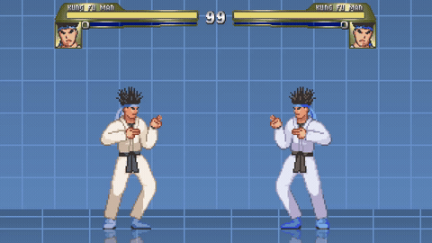

# IKEMEN GO

IKEMEN GO is the 2D fighting-game environment in WarGames.

Missions launch quick versus matches against bundled Kung Fu Man variants, with
opponent AI level and round count controlled by mission difficulty.

Rewards use trusted IKEMEN GO state exported from CommonLua: round state,
winner, player life, power, position, velocity, state number, control state,
and AI level.



WarGames uses the upstream [IKEMEN GO project](https://github.com/ikemen-engine/Ikemen-GO).
IKEMEN GO code is MIT licensed; the upstream package also includes non-code
assets with their own notices in the release archive.

## Run It

```bash
wargames install --game ikemen
wargames missions --game ikemen
wargames run \
  --game ikemen \
  --mission ikemen.vs.kfm.normal \
  --agent scripted-wait \
  --record summary_only
```

The game runs inside the IKEMEN GO Docker runtime image. `wargames install`
downloads the pinned Linux release archive into the IKEMEN GO Docker cache
volume and records the install manifest.

## Missions

WarGames ships quick versus missions across three opponents and three
difficulties.

| Difficulty | Missions |
|---|---:|
| Easy | 3 |
| Normal | 3 |
| Hard | 3 |
| Total | 9 |

```bash
wargames missions --game ikemen
```

Mission IDs use the opponent slug and difficulty, for example
`ikemen.vs.kfm.normal` and `ikemen.vs.kfm720.hard`.

## Live Control

IKEMEN GO uses the same primitive action format as the other games:

```bash
printf '%s\n' \
  '[{"name":"key_down","arguments":{"key":"ArrowRight"}},{"name":"wait","arguments":{"ms":300}},{"name":"key_up","arguments":{"key":"ArrowRight"}},{"name":"key_down","arguments":{"key":"z"}},{"name":"key_up","arguments":{"key":"z"}}]' \
  | wargames control \
      --game ikemen \
      --mission ikemen.vs.kfm.normal \
      --actions -
```

Useful controls:

| Action | Control |
|---|---|
| Move | Arrow keys |
| Light attacks | `z`, `x`, `c` |
| Heavy attacks | `a`, `s`, `d` |
| Start | `Enter` |
| Menu/back | `q` or `Escape` |
| Let the match advance | Send `wait` |

## Rewards

Rewards are scored from hidden IKEMEN GO match state after each action.

Useful signals:

| Signal | Why it matters |
|---|---|
| `p1.life` | Player survival. |
| `p2.life` | Opponent damage. |
| `p1.power` | Meter gain. |
| `match.round_state` | Fight phase. |
| `match.winner_team` | Match outcome. |
| `mission.finished` / `mission.failed` | Final outcome. |

Profiles:

| Profile | Use |
|---|---|
| `standard` | Deal damage, preserve life, build meter, and win the match |

```bash
wargames profile list --game ikemen
```

The IKEMEN GO profile files live in `scenarios/ikemen/profiles/`. The full
profile spec is in [`../reward_profiles.md`](../reward_profiles.md).

## Agent Setup

An agent is just a program that stays running. WarGames writes one observation
JSON line to stdin, waits for one turn JSON line on stdout, applies that turn to
IKEMEN GO, and repeats.

```python
import json
import sys

for line in sys.stdin:
    observation = json.loads(line)
    turn = [
        {"name": "key_down", "arguments": {"key": "ArrowRight"}},
        {"name": "wait", "arguments": {"ms": 300}},
        {"name": "key_up", "arguments": {"key": "ArrowRight"}},
        {"name": "key_down", "arguments": {"key": "z"}},
        {"name": "key_up", "arguments": {"key": "z"}},
    ]
    print(json.dumps(turn), flush=True)
```

```yaml
id: my-ikemen-agent
kind: subprocess
command: ["python", "my_agent.py"]
```
