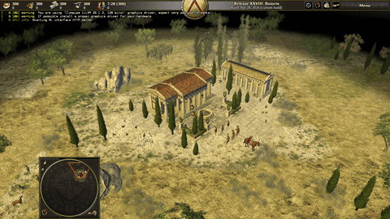

# 0 A.D.

0 A.D. is the ancient-warfare real-time strategy environment in WarGames.
Missions cover scenario and skirmish maps with gathering, construction,
population growth, exploration, and combat.

Rewards use 0 A.D. state through the upstream RL HTTP interface: players,
resources, population, entities, map size, victory conditions, and win/defeat
state.



## Run It

```bash
wargames install --game zeroad
wargames missions --game zeroad
wargames run \
  --game zeroad \
  --mission zeroad.scenario.arcadia.normal \
  --agent scripted-wait \
  --record summary_only
```

The game runs inside the 0 A.D. Docker runtime image. `wargames install` clones
and builds 0 A.D. with the upstream RL interface in the 0 A.D. Docker cache
volume.

## Missions

WarGames ships 390 0 A.D. missions: 130 scenario and skirmish maps exported in
easy, normal, and hard variants.

Regenerate the shipped catalog from the installed 0 A.D. tree when the runtime
version changes:

```bash
wargames missions --game zeroad --extract
wargames missions --game zeroad
```

Mission IDs use `zeroad.<map-type>.<map-name>.<difficulty>`, for example
`zeroad.scenario.arcadia.normal` or
`zeroad.skirmish.greek-acropolis-2p.normal`.

## Live Control

Send actions as JSON lines:

```bash
printf '%s\n' \
  '[{"name":"key_down","arguments":{"key":"ArrowUp"}},{"name":"wait","arguments":{"ms":1000}},{"name":"key_up","arguments":{"key":"ArrowUp"}}]' \
  | wargames control \
      --game zeroad \
      --mission zeroad.scenario.arcadia.normal \
      --actions - \
      --watch
```

Useful controls:

| Action | Control |
|---|---|
| Move camera | Arrow keys or drag with the mouse |
| Select units | Left click or drag select |
| Command selected units | Right click |
| Open menus | Standard 0 A.D. keyboard shortcuts |

## Rewards

Rewards are scored from 0 A.D. state after each action.

Useful signals:

| Signal | Why it matters |
|---|---|
| `us.resources` | Economy and stockpile growth. |
| `us.population` | Unit production and settlement growth. |
| `entities` | Full visible simulation entity state for combat shaping. |
| `enemies` | Active opponent player state. |
| `victory_conditions` | The configured win conditions. |
| `mission.finished` / `mission.failed` | Final outcome. |

Reward profiles:

| Reward profile | Use |
|---|---|
| `standard` | Grow resources, build population, damage enemies, and win |

```bash
wargames reward-profile list --game zeroad
```

The 0 A.D. profile files live in `scenarios/zeroad/profiles/`. The full profile
spec is in [`../reward_profiles.md`](../reward_profiles.md).

## Prime RL

```bash
uv pip install -e ./environments/prime

prime eval run wargames \
  --config environments/prime/configs/zeroad/eval-arcadia.toml \
  -n 1 -r 1
```
